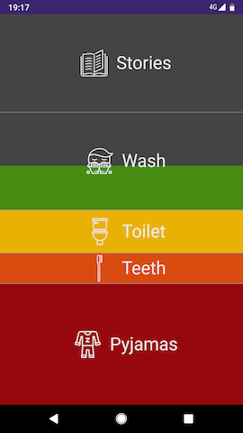

# Bedtimer

A progressive web app (PWA) to help young children visualise the passage of time during daily routines, and allow them to prioritise accordingly.

## Development

### Install

    npm install
    
### Run

    npm start
    
### Build

    npm run build
    
### Deploy

    npx now